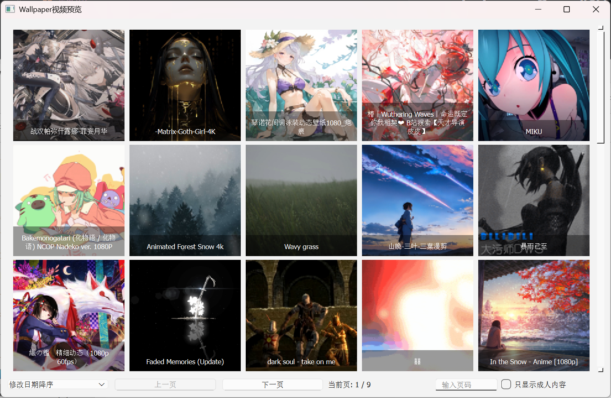

# Wallpaper Engine 视频查看器
用AI生成的基于Pyside6的视频查看器

## 使用方法
第一次运行时会让你选择Wallpaper Engine的下载路径
一般在C:\Program Files (x86)\Steam\steamapps\workshop\content\一串数字\

选择后会在程序目录下生成config.txt文件，里面记录了刚刚选择的路径
需要更改路径就修改这个文件，或者删除它重新运行程序

左键双击以默认打开方式打开这个视频
右键双击用系统资源管理器打开这个视频所在文件夹

输入页码需要输入指定页码，回车应用

推荐在2k分辨率下使用

## 声明
本人不会Python，也不懂其他任何语言的编程，99.99%的代码使用AI生成
